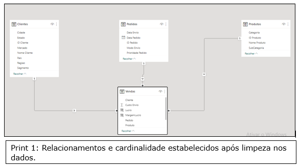
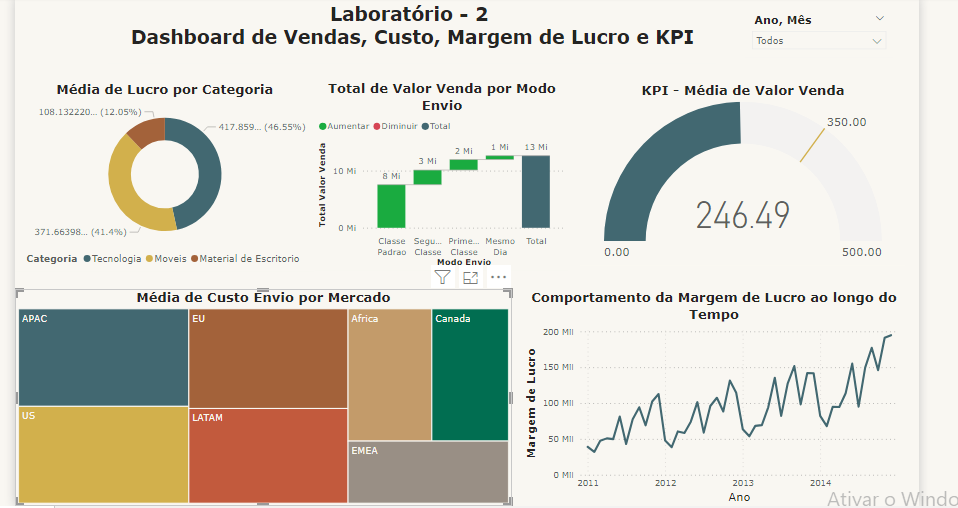

## Projeto Vendas no Microsoft Power BI - [Dashboard Analítico de Vendas Custo e KPI](https://app.powerbi.com/view?r=eyJrIjoiMjQzYjdkZjYtNmQzZi00ODZjLTllMmQtNWZhYzQ0NWI0MmZjIiwidCI6ImZkMzJmZDA0LTJmMmQtNDQ4MS1hZDcwLTY0Yzc2NWUxZDdjOCJ9) 

### Introdução

Este dashboard foi elaborado durante o curso  **Microsoft Power BI Para Business Intelligence e Data Science** da Data Science Academy ([DSA](https://www.datascienceacademy.com.br/)) 

O Dashboard foi elaborado a partir da necessidade de responder as seguintes perguntas de negócio:  

1. Qual foi o **total de valor venda** considerando cada **modo de envio dos pedidos**?  
2. Quais mercados tiveram o **maior custo médio de envio dos produtos vendidos**? 
3. A empresa tem como objetivo (meta) manter uma média de 350 para o valor de venda todos os meses. A empresa ficou abaixo ou acima da meta no mês de Abril/2014? 
4.  Qual **categoria de produto** apresentou maior lucro médio?  
5.  Qual foi o **comportamento da margem de lucro** ao longo do tempo? 

### Carga de Dataset e Transformação No Power BI

O dataset do projeto está separado em 4 arquivos no formato *csv*. Logo ao carregar os dados no PB notei alguns problemas que exigiram algumas transformações para isso, realizei a limpeza dos dados para a devida elaboração dos gráficos. 

 

### Coluna Calculada com DAX, KPI e Dashboard final

* Para responder as perguntas 4 e 5 foi necessário criar uma coluna calculada com DAX (Data Analysis Expressions);
* Para responder a questão 3 foi elaborado no PB um KPI ( Key Performance Indicator) indicando a média do valor de venda. 

Neste repositório você encontrará os datasets usados neste projeto. Abaixo apresento a versão final do dashboard de vendas e no link a seguir, a [versão interativa no Power BI online](https://app.powerbi.com/view?r=eyJrIjoiMjQzYjdkZjYtNmQzZi00ODZjLTllMmQtNWZhYzQ0NWI0MmZjIiwidCI6ImZkMzJmZDA0LTJmMmQtNDQ4MS1hZDcwLTY0Yzc2NWUxZDdjOCJ9).  

